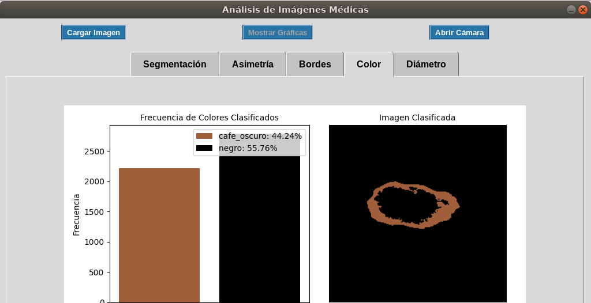

# Sistema para la detección de lesiones cutáneas
## Paso 1: Clonar el repositorio
Clona este repositorio dentro de tu espacio de trabajo:
```bash
git clone [URL_DEL_REPOSITORIO]
```
Reemplaza [URL_DEL_REPOSITORIO] con la URL de este repositorio en GitHub.

## Paso 2: Ejecución del código
Una vez clonado el repositorio, se observa una carperta con el nombre "my_project" donde se encuentra la carpeta de "classes" que contiene las clases de cada uno de los métodos empleados en la carpeta, ejecutar el script "main.py" y de esta forma se podra visualizar el GUI desarrollado. Tambien en la carpeta classes se observa el script "gui_jetson_nano.py", para poder ejecutar el código en el sistema embebido.

## Paso 3: Vizualización de los resultados

